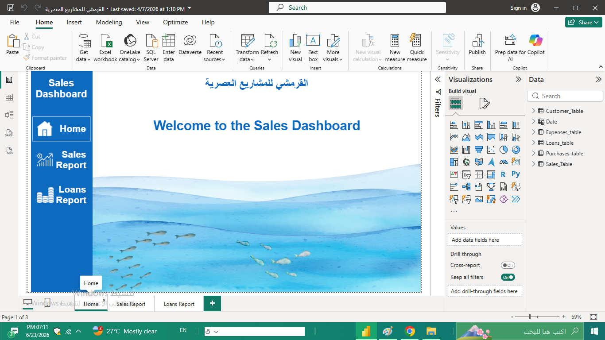

# Manufacturing-Sales-and-Loans-Dashboard
Power BI dashboard for monitoring sales, purchases, expenses, and customer loans in a manufacturing business.

Project Overview
This project was developed for a small manufacturing business to provide management with a monthly overview of business performance.

The dashboard tracks:
Sales performance
Purchases
Expenses
Customer outstanding balances
Loans and repayments

Due to confidentiality requirements, the original company data has been replaced with sample data while preserving the dashboard structure and functionality.

Business Objective
The company needed a simple reporting solution that allows management to monitor:
Revenue performance
Operational expenses
Purchase activities
Outstanding customer balances
Loan repayment status

Dashboard Pages
1. Home Page
Provides quick navigation between dashboard sections.

3. Sales Report
Key metrics include:
Total Sales
Profit
Total Purchases
Total Expenses
Outstanding Balances

Additional analysis:
Sales over time
Sales by type
Sales vs Purchases comparison
Monthly performance overview

3. Loans Report
Tracks customer loans and repayments.
Key metrics:
Total Loans
Total Paid
Outstanding Amount

Additional analysis:
Loans by month
Loan repayment trends
Remaining balances by customer

4. Data Model
The dashboard uses a relational data model connecting:
Sales
Purchases
Expenses
Loans
Customers
Date Dimension

Tools Used
Power BI
Power Query
DAX
Excel
Data Modeling

Skills Demonstrated
Data Cleaning
Data Transformation
Data Modeling
DAX Measures
KPI Design
Dashboard Development
Business Reporting
Key Features
Interactive filters
KPI monitoring
Multi-page navigation
Customer debt tracking
Monthly performance analysis
